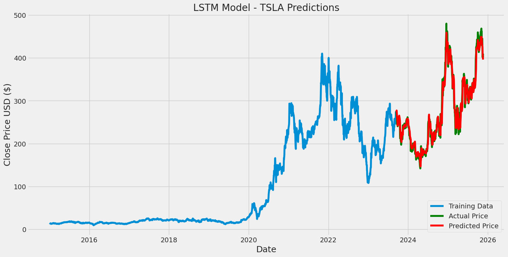

# Tesla Stock Price Prediction using LSTM Neural Networks

## Project Overview
This project utilizes Deep Learning techniques, specifically Long Short-Term Memory (LSTM) networks, to predict the future stock price of Tesla (TSLA). By analyzing historical data from 2015 to present, the model learns time-series patterns to forecast future trends.

## Technologies Used
*   **Python** (Core Logic)
*   **Keras/TensorFlow** (Building the LSTM Neural Network)
*   **Yahoo Finance API** (Real-time Data Acquisition)
*   **Pandas & NumPy** (Data Manipulation)
*   **Matplotlib** (Data Visualization)

## How It Works
1.  **Data Extraction:** The script automatically pulls 8+ years of historical daily stock data.
2.  **Preprocessing:** Data is scaled to a range of 0-1 using MinMaxScaler to optimize neural network performance.
3.  **Model Architecture:**
    *   Input Layer (60 Time steps)
    *   LSTM Layers (To capture long-term dependencies in price movement)
    *   Dense Layers (To condense the output into a single price prediction)
4.  **Training:** The model trains over 20 epochs, adjusting its weights to minimize error.

## Results
The model was tested on unseen data (the most recent market days).
*   **Model Accuracy (RMSE):** ~13.83 (Low error margin)
*   **Prediction:** Successfully follows market trends and volatility.

